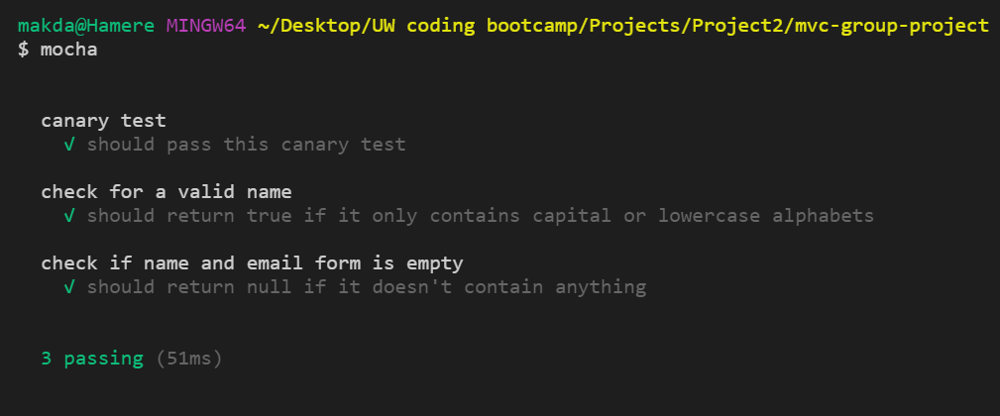

# Personality Inventory
## Overview
The Personality Inventory application is designed to provide users with opportunities for introspection while allowing teachers a chance to get to know their students at the beginning of the year. There are three personality tests users can take: Myers-Briggs, Disc, and Enneagram. [Crystal API](https://docs.crystalknows.com/) is used to complete the surveys and return the student's personality archetype. Users must create a profile within Crystal prior to taking the test. The data is stored in a relational database and each class is given a group name. To view results for each class, click on Group Results, and select your group name from the drop-down menu.


For a demo of the app, visit: <https://pure-meadow-76725.herokuapp.com/>

## Technologies Used
- JavaScript
- Jquery
- SQL
- Materialize CSS*
- Bootstrap CSS
- Node.js
- [Chart js](https://www.chartjs.org/)* 
- NPM modules - Dependencies: 
    - dotenv
    - express
    - express-handlebars
    - mySql2
    - Sequelize
    - Parsley.js
    - serve-favicon
- NPM modules - Developer's Dependencies:
    - chai
    - mocha
    - cross-env
    - eslint
    - eslint-config-prettier
    - eslint-plugin-prettier
    - prettier
    - serve-favicon
*New Technologies used (*) include Materialize CSS for css and Chart js for adding different charts and graphs to visually analyse your group's personality type results coming from the three different assessments(Ennegram/ Myers & Briggs/ DISC).
### Prerequisites

To download and test this app, you will need the Node Packet Manager installed.  For more information, visit: <https://www.npmjs.com/get-npm>

You will also need Node.js installed.  For more information, visit <https://nodejs.org/en/download/>

### Installing

To install, access the Github page <https://github.com/sjconst/mvc-group-project>.  You may fork the repository and then clone it to your computer.  

Next, you will need to download the required NPM packages. Because these packages are listed as dependencies already in the package.json file, you may install these packages by typing `npm install` on the commandline.

This app uses MySQL. You will need to set up your remote database by uploading the information in the `schema.sql` file located in the models folder. 

You will also need create a new file for storing your passwords and tokens to MySQL called `.env`. Create this within the root directory.
To set up your .env, copy and paste the following information and fill in you password. Add your database password and your Crystal API token. If you do not have a Crystal API token, visit <https://docs.crystalknows.com/developers/personality-assessments> to get started.

```
DB_PASS = YOURPASSWORD
Crystal_Token = d18a5972dc9f0d4460748e825941f8c6
```

Your app should now be ready for testing and then deployment.

Then, To use this app on your local device, and store the data on MySQL, run the following command on the command line:
```
node server.js
```

Then go to the following URL in your browser: `localhost:8080`
You should be able to enter your name, email, create a new group, and begin taking personality tests.
## Running tests
in your root project folder, type
```
$ mocha
```
It should look something like this


## Deployment and General Use
This app can be deployed to a server, such as Heroku or AWS, for online use from different users in different locations. To store data input, you will need to utilize an online database, such as the JAWSDB_URL add-on offered by Heroku.

## Next Steps
There are several functionalities we would like to add to this application:
- Add a functionality to grab the results and send an email to the email the use provided.  
- add learning styles to the results. The learning styles would either use an API or one coded by the project group.
- Add logins and user authentication

> Collaborators: Frederica Blissett [@redricasa](https://github.com/redricasa), Gerar Suaverdez [@gerarjon](https://github.com/gerarjon) , Sarah Arnold [@digipet007](https://github.com/digipet007), Stephanie Lake [@sjconst](https://github.com/sjconst)